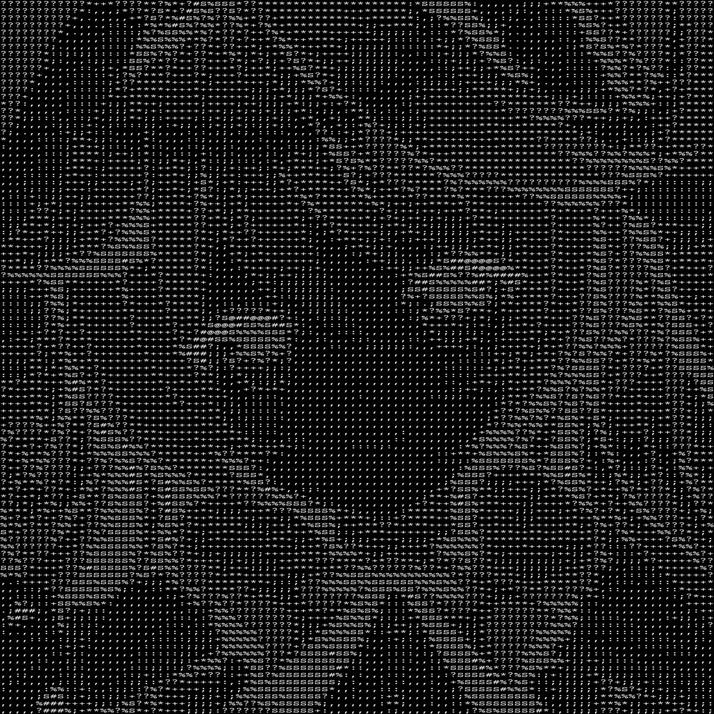

# Make some funny ASCII Arts

## Requirements

Aside from Python, You only need `pillow` library

``` bash
pip install pillow
```

## Run

You can simply run this command, for more arguments, you can refer to [`convert.py`](./convert.py)

``` bash 
python convert.py --use_resize True
```

## Results

From 


To

